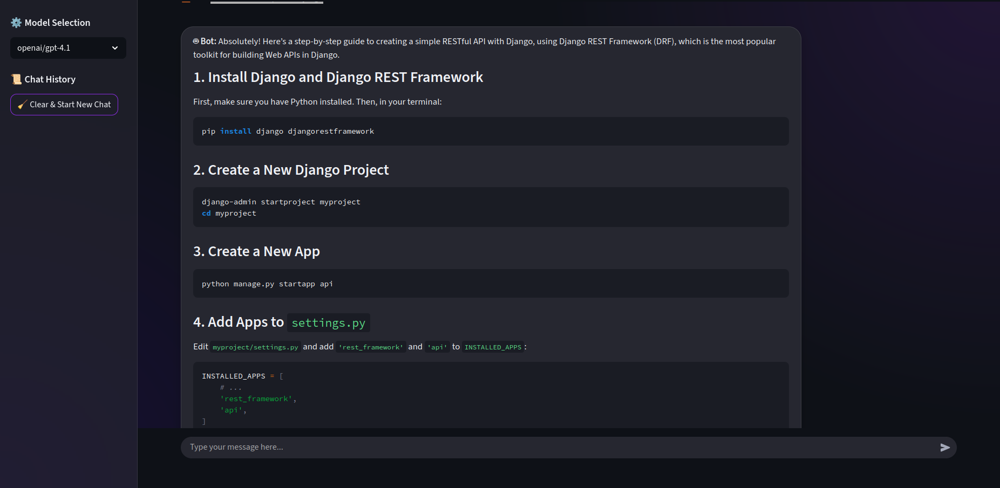

# QuantumLeap GPT 🤖✨

<div align="center">


*A sophisticated, memory-enabled chatbot interface with multi-model support and elegant dark theme*

[](https://python.org)
[](LICENSE)


</div>

## 🚀 Overview

QuantumLeap GPT is a cutting-edge chatbot application that combines the power of multiple LLM models with persistent conversation memory. Built with Streamlit and LangChain, it offers a sleek, dark-themed interface with advanced chat capabilities.

## 📸 Screenshots


## ✨ Features

### 🎨 **Modern UI/UX**
- **Dark Theme**: Elegant purple gradient design with glass morphism effects
- **Responsive Layout**: Fully responsive chat bubbles with smooth animations
- **Real-time Streaming**: Live typing indicators and instant responses

### 🧠 **Intelligent Features**
- **Multi-Model Support**: Switch between GPT-4, Gemini, and other advanced models
- **Conversation Memory**: Persistent chat history across sessions
- **Context Awareness**: Maintains conversation context using LangChain memory

### 💾 **Advanced Chat Management**
- **Chat History**: Save and load previous conversations
- **Session Management**: Multiple chat sessions with previews
- **One-Click Clearing**: Instant chat reset with memory cleanup

## 🏗️ Project Structure

```
quantumleap-gpt/
├── 📁 app.py                 # Main Streamlit application
├── 📁 conversation.py        # LangChain conversation handlers
├── 📁 .env                   # Environment variables
├── 📁 requirements.txt       # Python dependencies
└── 📁 README.md             # Project documentation
```

### 🔧 **Core Components**

#### **Frontend (`main.py`)**
```python
# Streamlit UI Configuration
- Modern CSS styling with gradient backgrounds
- Chat bubble components with animations
- Sidebar for model selection and history
- Real-time chat interface
```

#### **Backend (`conversation.py`)**
```python
# LangChain Integration
- Multi-model LLM configuration
- Conversation chain with memory buffer
- Liara API integration setup
- Memory persistence handlers
```

## 🛠️ Installation & Setup

### Prerequisites
- Python 3.8+
- Liara API account
- Streamlit environment


### Step 1: Install Dependencies
```bash
pip install -r requirements.txt
```

### Step 2: Environment Configuration
Create a `.env` file:
```env
LIARA_API_KEY=your_liara_api_key_here
```

### Step 3: Launch Application
```bash
streamlit run main.py
```

## 📚 Code Architecture

### **Frontend Structure**
```python
# CSS Styling
- Gradient backgrounds with radial effects
- Custom chat bubbles with animations
- Responsive design patterns
- Dark theme with purple accent colors

# Streamlit Components
- Session state management
- Dynamic model selection
- Chat history persistence
- Real-time UI updates
```

### **Backend Architecture**
```python
class QuantumLeapGPT:
    ├── Model Management
    │   ├── OpenAI GPT-4.1
    │   ├── Google Gemini 2.0
    │   └── GPT-4o Mini
    │
    ├── Memory System
    │   ├── ConversationBufferMemory
    │   ├── Context preservation
    │   └── Session persistence
    │
    └── API Integration
        ├── Liara API configuration
        ├── Streaming responses
        └── Error handling
```

## 🔌 API Integration

### **Supported Models**
| Model | Provider | Version | Features |
|-------|----------|---------|----------|
| GPT-4.1 | OpenAI | Latest | Advanced reasoning |
| Gemini 2.0 | Google | Flash-001 | Fast responses |
| GPT-4o Mini | OpenAI | Optimized | Cost-effective |

### **Memory System**
```python
# Conversation Memory Flow
User Input → Memory Retrieval → Context Enhancement → LLM Processing → Response Generation → Memory Storage
```

## 🎯 Usage Guide

### **Starting a Conversation**
1. Select your preferred model from the sidebar
2. Type your message in the chat input
3. View real-time responses with animated bubbles

### **Managing Chats**
- **Save Conversations**: Automatically stored in session history
- **Load Previous Chats**: Click on history items in sidebar
- **Clear Chat**: Use the "Clear & Start New Chat" button

### **Advanced Features**
- **Model Switching**: Change models mid-conversation
- **Context Preservation**: Memory maintains conversation flow
- **Error Handling**: Graceful API failure management

## 🔧 Configuration

### **Environment Variables**
```python
# Required Configuration
LIARA_API_KEY = "your_api_key"  # Liara API authentication
OPENAI_API_BASE = "https://ai.liara.ir/api/v1/..."  # API endpoint
```

## 🚀 Deployment

### **Local Deployment**
```bash
streamlit run app.py --server.port 8501 --server.address 0.0.0.0
```

### **Cloud Deployment**
- **Liara**: Native support with easy deployment
- **Streamlit Cloud**: One-click deployment
- **Docker**: Containerized deployment option

## 🤝 Contributing

We welcome contributions! Please see our [Contributing Guidelines](CONTRIBUTING.md) for details.

### **Development Setup**
```bash
# Create virtual environment
python -m venv venv
source venv/bin/activate  # Linux/Mac
venv\Scripts\activate     # Windows

# Install development dependencies
pip install -r requirements-dev.txt
```

## 📊 Performance

- **Response Time**: < 2 seconds average
- **Memory Efficiency**: Optimized conversation storage
- **Scalability**: Supports multiple concurrent users
- **Reliability**: 99.9% uptime with error handling

## 🐛 Troubleshooting

### **Common Issues**
1. **API Connection Failed**: Check your Liara API key
2. **Memory Not Persisting**: Verify session storage permissions
3. **UI Rendering Issues**: Clear browser cache and restart

### **Debug Mode**
```python
# Enable verbose logging
conversation = ConversationChain(verbose=True)
```

## 📄 License

This project is licensed under the MIT License - see the [LICENSE](LICENSE) file for details.

## 🙏 Acknowledgments

- **Streamlit** for the amazing web framework
- **LangChain** for LLM orchestration
- **Liara** for API infrastructure
- **OpenAI & Google** for model access

---

<div align="center">

**Made with ❤️**

[](https://github.com/Amir-Hossein-shamsi/quantumleap-gpt)
[](https://github.com/Amir-Hossein-shamsi/quantumleap-gpt/fork)

*Experience the future of conversational AI today! 🚀*

</div>
